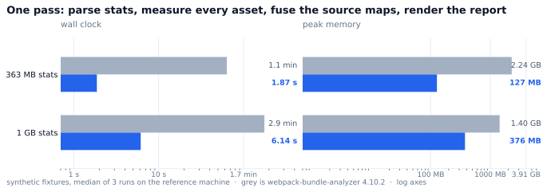
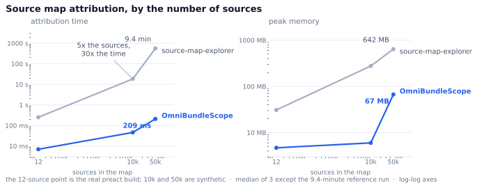
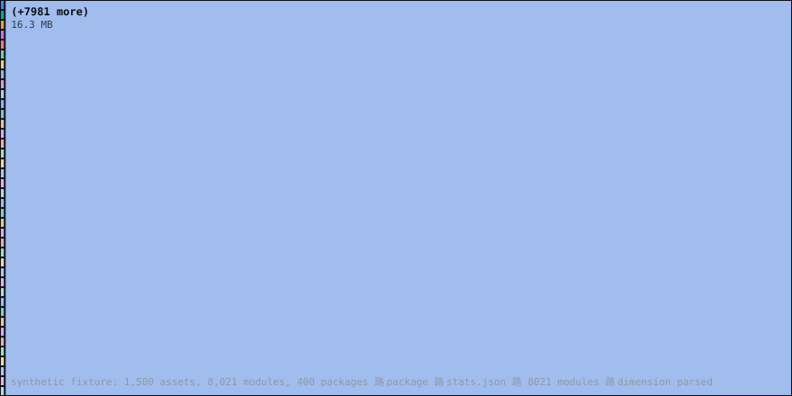

<div align="center">

# FastScope

**One analyzer for every bundler.** Read webpack and rspack `stats.json`, esbuild
`metafile.json`, or nothing but the output folder itself — and get one size
graph, with real byte attribution, in a fraction of the memory.

[]({{REPO_URL}}/actions/workflows/ci.yml)
[](#install)
[](https://doc.rust-lang.org/stable/notes.html)
[](LICENSE-MIT)

**[English](README.en.md) · [中文](README.zh.md) · [日本語](README.ja.md) · [Deutsch](README.de.md)**

</div>

<p align="center">
  <a href="#supported-bundlers">supported bundlers</a> ·
  <a href="#the-problem">the problem</a> ·
  <a href="#the-measurements">the measurements</a> ·
  <a href="#ghost-code-and-hidden-code">ghost &amp; hidden code</a> ·
  <a href="#install">install</a> ·
  <a href="#status">honest status</a> ·
  <a href="#why">why it is built this way</a>
</p>

---

## Supported bundlers

| bundler | what FastScope reads | needs `dist/` + `*.map`? | ghost code detection |
|---|---|---|---|
| **webpack** 4 / 5 | `stats.json` | no | yes |
| **rspack** | `stats.json` (same schema) | no | yes |
| **esbuild** | `metafile.json`, or the output folder | with `--metafile`, no | with `--metafile`, yes |
| **Vite** | the output folder and its source maps | yes | needs `--stats` output to enable |
| **Rollup** | the output folder and its source maps | yes | needs a `stats.json` |
| **Parcel** | the output folder and its source maps | yes | needs a `stats.json` |
| **tsup / esbuild wrappers** | the output folder and its source maps | yes | needs a `stats.json` |
| **Angular / Next.js / Nuxt / SvelteKit** | whatever they emit, which is webpack or vite output | depends | depends |

Two input shapes, and the difference matters:

- **A bundler graph** — `stats.json`, `metafile.json` — gives the dependency
  structure *and* the declared sizes. This is the only shape where **ghost code**
  can be detected, because a ghost is defined as a module the bundler declared
  and shipped that no source map accounts for.
- **Just the output** — a `dist/` folder with `*.map` beside it — gives measured
  file sizes and per-source attribution, which is all of vite, rollup, parcel and
  tsup give you by default. Sizes here are exact, because they are measured
  rather than estimated. Ghost detection reports itself as unavailable instead of
  claiming zero:

```
$ fastscope ./dist
dist  ·  9 modules  ·  4 assets  ·  3 packages  ·  ingest 8 ms  ·  total 10 ms  ·  dimension parsed
fusion: 2 map(s) · coverage 97% · 9/9 modules attributed · ghost code needs a stats.json to detect · 0 hidden source(s) (0 KB)
wrote fastscope-report.html (0.0 MB), detail inlined
```

Nothing is configured, and `dist/` is read recursively, because that is where
vite puts everything: `dist/assets/index-BqP1xK.js`,
`dist/assets/vendor-Dk9mZ2.js`, their maps, the CSS and `index.html`. A map that
cannot be read is named on stdout, because a silently dropped map turns into a
coverage number that looks like a build without source maps.

If your bundler can emit a graph, turn it on and you get everything:

```bash
# vite
vite build --mode analyze     # writes dist/stats.json

# webpack
webpack --profile --json > dist/stats.json
```

## The problem

You point a bundle analyser at a build and it runs out of memory, or takes a
minute, and gives you a picture you cannot act on. `webpack-bundle-analyzer`
holds the entire `stats.json` in the JS heap: on a 363 MB build that is
**63.6 seconds and 2.3 GB** to answer "how big is this?" And once it has drawn
the treemap it still cannot tell you the two things that actually cost you
money — see [below](#ghost-code-and-hidden-code).

FastScope streams the stats file, measures the emitted bytes, joins the source
maps onto the module graph, and says which dimension it used.

## The measurements

Full pipeline — parse stats, measure every asset on disk, fuse the source maps,
render the report. Synthetic fixtures, median of three runs, reference machine.

<picture>
  <source media="(prefers-color-scheme: dark)" srcset="docs/assets/chart-pipeline-dark.svg">
  
</picture>

| input | FastScope | webpack-bundle-analyzer | ratio |
|---|---|---|---|
| 363 MB `stats.json`, 154,379 modules | **1.87 s / 127 MB** | 63.6 s / 2,295 MB | **34× faster, 18× smaller** |
| 1 GB `stats.json`, 445,602 modules | **6.14 s / 376 MB** | 176.3 s / 1,437 MB | 29× faster, 3.8× smaller |

Source map attribution, by how many sources the map holds. This is the
superlinearity that makes big maps unusable in the reference tool: **five times
the sources costs it thirty times the time**, while ours stays linear.

<picture>
  <source media="(prefers-color-scheme: dark)" srcset="docs/assets/chart-source-maps-dark.svg">
  
</picture>

Every number here is reproducible with the harness in `bench/`, and the raw
records are committed: [`docs/assets/charts-data.json`](docs/assets/charts-data.json)
lists each figure with its provenance, and
[the evidence log](docs/en/01-evidence.md) has the sessions behind it.

## Ghost code and hidden code

The two things neither reference tool can tell you. This is the part that is
actually new.

- **Ghost code** — a module the bundler declared and shipped that *no* source map
  accounts for. Tree-shaking missed it, or the asset was built without a map. It
  is in your bundle and in nobody's size report.
- **Hidden code** — generated bytes that map back to *no* module. An inlined
  snippet, an `eval`, a polyfill the bundler injected. It is in your bundle and
  in no module's size.

FastScope folds each source's byte share into the modules that produced it, and
whatever does not reconcile becomes a diagnostic instead of a rounding error:

```
$ fastscope ./dist
dist  ·  50000 modules  ·  1 assets  ·  0 packages  ·  ingest 2143 ms  ·  total 2845 ms  ·  dimension attributed
fusion: 1 map(s) · coverage 100% · 50000/50000 modules attributed · ghost code needs a stats.json to detect · 0 hidden source(s) (0 KB)
wrote dist/report.html (0.1 MB), detail in a companion script (loaded on demand)
```

and when it does not add up, it says which way. A build where one of two assets
ships without a source map:

```
$ fastscope ./dist
dist  ·  22 modules  ·  2 assets  ·  11 packages  ·  ingest 4 ms  ·  total 6 ms  ·  dimension parsed
fusion: 1 map(s) · coverage 47% · 0/22 modules attributed · 22 ghost (83 KB of declared) · 3 hidden source(s) (39 KB)
```

Note `dimension parsed`, not `attributed`: half the build is unmapped, so the
ground-truth dimension was withdrawn and the report says so on its first line.
A tool that quietly averaged the two in would be reporting a number that belongs
to no measurement.

Attribution is a longest-suffix path match on the real join key
([`unified-graph.md`](docs/contracts/unified-graph.md)), never a content hash,
and the corrected sizes are checked against the asset total by an invariant that
fails loudly (`FS0042`) instead of quietly rounding. A map that covers only part
of the build downgrades the report from the `attributed` dimension to `parsed`
and the CLI says so — a report that claimed ground truth it did not have would
be worse than no report.

## The report

<p align="center">
  
</p>

<sub>The 40 largest packages of a synthetic 400-package build: 1,500 assets and
8,041 modules, in the sizes the bundler declared. Drawn from the tool's own
graph payload by `bench/harness/render-treemap.py`, not a screenshot, so the
labels are the tool's output; CI regenerates the image and fails on a diff. The
HTML report adds search, three grouping dimensions, a per-module drill-down,
light/dark, and no network requests.</sub>

## Install

**Not published yet.** There is no `fastscope` on npm and no crate to install,
so `npx fastscope` and `cargo install fastscope-cli` do not work today, and
this README does not offer them. Build it instead:

```bash
git clone {{REPO_URL}}.git
cd fastscope
cargo build --release
./target/release/fastscope ./dist
```

When a `v*` tag is pushed, the release workflow publishes in the order given in
`docs/en/06-release-and-ci.md` §2 — binaries to GitHub releases, then
`fastscope-core` to crates.io, then the npm wrapper, because the npm name is the
scarcest resource here and is spent last. The npm and crates.io badges and the
two install one-liners come back in the commit that fills in `repo-links.json`.
The npm wrapper verifies `checksums.txt` before it writes or executes anything.

## Use

```bash
fastscope ./dist                      # a folder: stats + assets + *.map
fastscope ./dist/stats.json           # a stats file
fastscope ./dist/metafile.json        # an esbuild metafile

fastscope ./dist --budget fastscope.config.json   # exits 1 on a breach
fastscope ./dist --mode json > sizes.json          # for CI or BI
fastscope ./dist --mode csv  > sizes.csv
fastscope ./dist/map.js.map --bench-map            # attribution only, timed
```

```jsonc
// fastscope.config.json
{
  "limits": [
    { "scope": "total",   "max": 1_500_000 },
    { "scope": "chunk",   "match": "vendor", "max": 800_000 },
    { "scope": "package", "match": "moment", "max": 250_000, "dimension": "gzip" }
  ]
}
```

<details>
<summary>Exit codes — part of the contract, because CI gates are built on them</summary>

| code | meaning |
|---|---|
| 0 | analysed, and every budget held |
| 1 | analysed, and a budget was breached (`FS0040`) |
| 2 | bad command line |
| 3 | input unreadable, or a budget rule that matches nothing |

A budget rule that matches nothing is an error on purpose: a typo in a rule must
not quietly pass CI.

</details>

## Status

Pre-1.0, and this is the honest table. Anything unmeasured says so.

| area | state |
|---|---|
| stats ingest, size attribution, source maps, fusion, report, budgets, JSON/CSV | implemented, measured, gated in CI |
| 1 GB ingest, wall clock | **misses**: 4.40 s against a 3 s target (memory is fine at 350 MB) |
| report first paint / 30 fps | **unverified** — CI has no browser; measured instead as 1.56 MB and 1.27 s at 154,379 modules |
| WASM build, WebGL renderer | not started |
| Windows / macOS / Linux | tested in CI on all three |
| 67 Rust tests, 4 npm tests, 1,018 generated layout cases | green |

The one miss is stated with its cause in the [changelog](CHANGELOG.md): it is
`serde_json`'s DOM cursor over a 445,602-element module array.

## Why

Every design decision traces to a measurement, not a preference.

| decision | evidence |
|---|---|
| streaming JSON, not `simd-json` | `simd-json` needs the whole document in memory — that is the ceiling we are removing ([ADR-0001](docs/decisions/ADR-0001-streaming-over-simd-json.md)) |
| our own HTML report, no vendored viewer | a viewer we do not control cannot show fusion data without a fork ([ADR-0002](docs/decisions/ADR-0002-self-built-report.md)) |
| rayon for size and gzip work | 25,600 assets: 2,177 ms serial → **342 ms** (6.4×); the parse was never the bottleneck |
| a suffix index for the join | scanning every source per module is 2.5 billion comparisons; the index made it 73.8 s → 4.9 s |
| exact counts, bounded lists | one entry per unmapped module cost 47 MB for a field documented as a *summary* |
| property tests over fixtures | two real defects — module sizes never scaled **down**, and an out-of-range source index made attribution vanish silently — that no fixture in the repo could see |

### What we did not build, and why

| rejected | reason |
|---|---|
| vendor WBA's viewer | it cannot show fusion data without a fork, and then we own a UI we do not control |
| `simd-json` | needs the document in memory, which is the problem |
| WebGL treemap in Phase 1 | 10k nodes is fine on Canvas 2D; the swap is Phase 2 behind a stable payload |
| a general build tool | measured pain is a memory ceiling, a per-item process, or a superlinear algorithm. This has all three. |

## Documentation

- [Product requirements](docs/en/00-prd.md) · [Evidence log](docs/en/01-evidence.md) · [Architecture](docs/en/02-architecture.md)
- [Benchmarks and targets](docs/en/04-benchmark-plan.md) · [Parity and testing](docs/en/05-parity-and-testing.md) · [Releases and CI](docs/en/06-release-and-ci.md)
- [Contracts](docs/contracts/) — payload schema, CLI surface, benchmark protocol, i18n rules, ownership
- [ADRs](docs/decisions/) · [Risk register](docs/en/07-risk-register.md) · [Roadmap](docs/en/08-roadmap.md)

## Contributing

Every change ships with a measurement, or an argument for why it cannot have
one. See [CONTRIBUTING.md](CONTRIBUTING.md); the gates are `cargo test`,
`clippy -D warnings` (pedantic), `cargo fmt`, 70% coverage floor, parity
against `webpack-bundle-analyzer`, and a four-language docs check.
[Code of conduct](CODE_OF_CONDUCT.md) · [Security](SECURITY.md)

## Licence

MIT ([LICENSE-MIT](LICENSE-MIT)) or Apache-2.0
([LICENSE-APACHE](LICENSE-APACHE)), at your option.

---

## Supported bundlers, again

Because it is the first question, and because a tool that says "every bundler"
without saying which ones is not making a claim worth reading:

**webpack** (4 and 5, via `stats.json`) · **rspack** (via `stats.json`) ·
**esbuild** (via `metafile.json`) · **Vite** · **Rollup** · **Parcel** ·
**tsup** · and the output of anything built on them — **Angular**, **Next.js**,
**Nuxt**, **SvelteKit**, **React Server Components** builds.

Two input shapes:

```bash
fastscope ./dist/stats.json   # a bundler graph: webpack, rspack, esbuild --metafile
fastscope ./dist              # just the output folder: vite, rollup, parcel, tsup
```

The second needs nothing configured — point it at `dist/` and the source maps
your bundler already writes are enough. The first additionally enables **ghost
code** detection, because that question needs a declared module graph.

| bundler | graph | attribution | ghost code |
|---|---|---|---|
| webpack, rspack | `stats.json` | source maps | yes |
| esbuild | `metafile.json` | source maps | with the metafile |
| vite, rollup, parcel, tsup | not by default | source maps | with a `stats.json` |

---

## Project


| | |
|---|---|
| 67 Rust tests, 4 npm tests, 1,018 generated layout cases | green on Linux, Windows and macOS |
| coverage floor | 70%, enforced in CI |
| benchmark targets | 9 of 10 met; the miss is named in the [changelog](CHANGELOG.md) |
| parity vs `webpack-bundle-analyzer` | 0 ppm on assets and modules, real webpack builds |
| languages | English (normative), 中文, 日本語, Deutsch |

---

<div align="center">
  <sub>
    Built in public. Disagreements about the numbers are welcome in
    <a href="{{REPO_URL}}/issues">issues</a> — they are
    the only thing keeping a benchmark meaningful.
  </sub>
</div>
