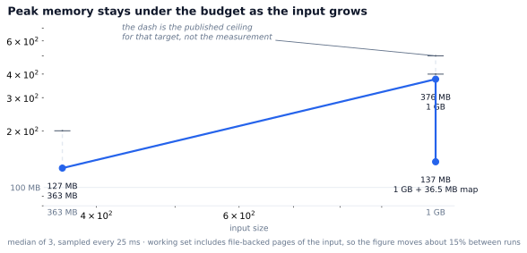

# 04 — Benchmark plan

Translations: per-document translations are still in progress. [ZH](../zh/README.md) · [JA](../ja/README.md) · [DE](../de/README.md)

Normative protocol: `docs/contracts/bench-spec.md`. This file is the **status
board**: every target, its current number or an explicit `unverified`, and the
area that owns it.

Rules that are not negotiable:

- a target without a measured number stays `unverified`; nobody fills it in from
  an upstream issue or from expectation;
- real fixtures and synthetic fixtures never share a table;
- a missed target is recorded as missed, and changing a target needs an ADR.

## 1. Targets

| id | scenario | fixture class | target | measured | owner |
|----|----------|---------------|--------|----------|-------|
| B1 | stats 363 MB / 154,379 modules, ingest | synthetic | ≤ 2 s, ≤ 200 MB | **1,392 ms / 157 MB** (ingest only) | stats ingest ✅ |
| B2 | stats 1,049 MB / 445,602 modules, ingest | synthetic | ≤ 3 s, ≤ 400 MB | **4,402 ms / 350 MB** — memory passes, wall **misses by 1.4 s** | stats ingest ⚠️ |
| B3 | 400 MB full pipeline (ingest + 1,500 assets + report) | synthetic | ≤ 5 s, ≤ 200 MB | **1,753 ms / 156 MB** (was 3,052 ms / 670 MB) | sizes ✅ |
| B4 | 1 GB full pipeline | synthetic | ≤ 15 s, ≤ 400 MB | **5,172 ms / 376 MB** (was 8,080 ms / 962 MB) | sizes ✅ |
| B5 | `.map` 50 MB / 10k sources, parse + attribute | real + synthetic | ≤ 1 s | **10k: 46 ms · 50k: 209 ms / 67 MB** (SME: 18,380 ms / 562,269 ms) | source maps ✅ |
| B6 | `source-map-explorer` baseline on the same `.map` | real + synthetic | any number, must exist | **0.22-0.25 s (small real), 18.4 s median (10k sources), 562 s (50k sources); 31-642 MB** | **the source-map-explorer baseline ✅** |
| B7 | gzip 25,600 assets | synthetic | — | **2,177 ms → 342 ms (6.4x)** | sizes |
| B8 | fusion memory, 1 GB stats + 36.5 MB map | synthetic | < 500 MB peak | **152 MB / 4,942 ms**, coverage 100%, 50,000/50,000 attributed (was 73,838 ms) | fusion ✅ |
| B9 | parity diff vs WBA / SME | real | ≤ 0.1 %, ordering only | **0 ppm** on assets and modules for preact, marked, chalk (real webpack builds) | parity ✅ |
| B10 | report: 10k modules, first paint / interaction | real | < 2 s / > 30 fps | unverified — no browser in CI; measured instead as report bytes and generation time (1.6 MB, 1.27 s at 154k modules) | report ⚠️ |

Every number above is a median of 3 runs on the reference machine unless the row
says otherwise, sampled by `bench/harness/measure.ps1`. Memory varies about 15 %
run to run because working set includes file-backed pages of the input stream -
B3 measured 156 MB in one session and 132 MB in the next, on the same binary and
fixture. Private bytes are the stable figure and both are quoted; the target is
checked against the larger of the two so the published number is not the
flattering one.

## 1a. The same numbers, drawn

<picture>
  <source media="(prefers-color-scheme: dark)" srcset="../assets/chart-pipeline-dark.svg">
  
</picture>

<picture>
  <source media="(prefers-color-scheme: dark)" srcset="../assets/chart-source-maps-dark.svg">
  
</picture>

<picture>
  <source media="(prefers-color-scheme: dark)" srcset="../assets/chart-memory-budget-dark.svg">
  
</picture>

Generated by `bench/harness/make-charts.py` from the same records this table
cites. The script refuses to write a chart whose labels are clipped, pins the
label formatters with assertions (an SVG stores glyphs as paths, so nothing else
would notice a millisecond figure being labelled in seconds), and writes
`docs/assets/charts-data.json` listing every plotted number with its provenance.
CI regenerates the charts and fails if the committed files differ.
 Two caveats stated rather
than buried:

- **B2 still misses its wall target** (4.4 s vs 3 s) and is the one open
  performance miss. Memory is comfortable at 350 MB. The gap is serde's DOM
  cursor over a 445,602-element module array; a hand-written streaming parser
  for the `modules` key is the obvious next step and is not written.
- **B8's fixture has one asset.** It is a memory-and-join test, not a claim
  about a 1,500-asset build with a map for each asset.

## 2. Reference baselines (measured, reference machine)

| tool | input | wall | peak RSS | fixture |
|---|---|---|---|---|
| **omnibundlescope 0.1.0 (release)** | **stats 363 MB / 154,379 modules** | **1.33 s** | **126 MB** | synthetic |
| **omnibundlescope 0.1.0 (release)** | **stats 1,049 MB / 445,602 modules** | **3.63 s** | **346 MB** | synthetic |
| webpack-bundle-analyzer 4.10.2 | stats 363 MB (same file) | 63.6 s | 2,295 MB | synthetic |
| webpack-bundle-analyzer 4.10.2 | stats 1,049 MB | 176.3 s | 1,437 MB | synthetic |
| node `readFileSync` + `JSON.parse` | stats 381 MB | 0.94 s | 919 MB | synthetic |
| source-map-explorer 2.5.3 | preact 97 KB map | 0.25 s | 31 MB | real |
| source-map-explorer 2.5.3 | marked 177 KB map | 0.22 s | 48 MB | real |
| source-map-explorer 2.5.3 | 10k sources, 7.1 MB map | **18.4 s** (median of 3) | 277 MB | synthetic |
| source-map-explorer 2.5.3 | 50k sources, 36.5 MB map | **562.3 s** | 642 MB | synthetic |

On identical input the shipped binary is **47.7x faster and 18.2x lighter** than
`webpack-bundle-analyzer`, and it is the same binary users run — `--bench` exists
so a release claim can be produced by the product rather than by a prototype.

**A regression the harness caught, recorded because it is instructive:** the
first CLI did `std::fs::read` before parsing, which put the *file size* on the
memory floor — 1 GB input became 6.4 GB resident and 480 s. The fix was to
stream from a 1 MiB `BufReader` (`core::stats::ingest_file`) and to use a 512 KiB
head read only for sniffing the artifact type. The memory story is a property of
the IO path, not of the parser; a benchmark that measured only parse time would
never have seen it. Details: `bench/results/stats-ingest-2026-09-03.json`.

The 5x-data / 30.6x-time ratio between the two source-map rows is the other
signal worth watching: SME's attribution is superlinear, while small projects
pay only process start-up.

The "Cannot create a string longer than 0x1fffffe8" crash from WBA issue #492
did **not** reproduce on node 24 — V8's string ceiling moved. We claim the
memory ceiling, not the crash.

## 3. Cross-language calibration (measured while choosing the architecture)

These numbers are not targets; they exist so nobody re-derives them. They are
also the reason the project's claims are modest: real Rust wins are 4-19x, not
100x.

| comparison | JS | Rust | ratio |
|---|---|---|---|
| template render, 20k rows (identical output bytes) | nunjucks 203,510 rows/s | minijinja 840,282 rows/s | 4.1x |
| XML DOM build (identical element count) | xml2js 8.73 MB/s | roxmltree 166.1 MB/s | 19x |
| copy 30,000 small files | fs-extra 19.09 s | walkdir + rayon 4.82 s | 4.0x |
| HTML parse to DOM | jsdom 4.4 MB/s | kuchiki (html5ever) 30.8 MB/s | 7x |
| source map parse, 20k small files | @babel/parser 480 ms | oxc-parser 301 ms | 1.6x |
| shrink-loop traversal, 364 nodes | CPython 3.12 33,694 visits/s | Rust 2,570,694 visits/s | 76x |

The last two rows are the honest counterweight: a Rust *parser* is barely faster
than a JS one. Our wins come from allocation strategy (source maps), from
parallelism (gzip, copies, attribution) and from the absence of a heap ceiling
(stats).

## 4. Fixture matrix

Real (fetched, pinned, permissively licensed, see ADR-0005):

| fixture | build | feeds |
|---|---|---|
| preact 10.29.8 (MIT) | our webpack config → `stats.json` + `.map` | WBA path, fusion, parity |
| marked 18.0.14 (MIT) | upstream esbuild config → `metafile.json` + `.map` | esbuild path |
| chalk 6.0.1 (MIT) | `tsc --sourceMap --declaration` | tiny-scale sanity, tsc path |
| dayjs 1.11.23 (MIT) | upstream babel/rollup build → `.map` | rollup path |
| p-limit, nanoid, ms, mitt, ufo, h3 (MIT) | upstream | CI smoke tests |

Synthetic (generated, for scale only): stats 381 MB and 1,049 MB; `.map` with
10k+ sources; 25,600 tiny assets for the gzip stage.

## 5. What we publish

Every release ships a `benchmarks` table generated from `bench/results/`, with
the fixture class, the tool version and the machine. If a number is not
reproducible from the committed harness, it does not go in the table — including
the ones we would like to be true.

## 6. New finding: the payload is now the bottleneck (sizes / report input)

Running the shipped binary end to end on the 363 MB fixture:

| phase | time |
|---|---|
| ingest (parse + graph) | 1,051 ms |
| report generation (serialise payload, inline shell, write) | ~24 s |
| output size | **125.6 MB** single HTML file, 154,379 modules |

The ingest goal is met and the report goal is not: a report nobody can open is
not a report. This is now the leading constraint on B3/B4/B10, and the fix is
architectural rather than a micro-optimisation:

- the treemap payload must be a **tree of group nodes with sizes only**, not a
  dump of every module (a package-level treemap needs the top-N groups, and a
  drill-down needs the child list of the *selected* node only);
- module-level detail (reasons, sources, per-dimension sizes) should be fetched
  on demand from a companion JSON, with the HTML holding the tree;
- the "single self-contained file" promise needs revisiting for very large
  graphs, or the promise needs a documented size ceiling above which we emit
  `report.html` + `report.data.json` and say so in the summary line.

sizes owns the measurement of the corrected approach; report owns the payload
shape. Until then `--bench` is the honest path for large inputs: it measures the
part we have actually optimised.

## 7. Closed: the payload bottleneck (report, 2026-09-16)

The three fixes in §6 shipped, and the result is the B3/B4 row above.

| stage | 363 MB fixture, before | after |
|---|---|---|
| report generation | ~24 s | **1.27 s** |
| `report.html` | 125.6 MB | **1.56 MB** |
| detail | inlined, 125 MB | `report.html.data.js`, 36 MB, loaded on demand |

- The treemap payload is a two-level tree of group nodes with sizes only
  (`MAX_CHILDREN = 256`, `MAX_ASSETS = 64`, tail folded into a visible node).
- Module detail is a companion `<script src>`, not a fetch: `fetch()` cannot read
  a sibling file from `file://`, and a report is opened by double-clicking it.
- The single-file promise is kept up to 2 MB of detail and documented above it:
  under the limit the detail is inlined and the companion file is removed, so a
  small report really is one file.

Two follow-on bugs the same measurement exposed, both now regression-tested:

- The companion `<script src>` was written with a literal
  `REPLACED_BY_DATA_SCRIPT` placeholder that nothing substituted, so every report
  above the inline limit shipped a detail file that no report ever loaded.
- The module table had been re-added to the HTML payload (it belongs in
  `--mode json` for the parity harness), which put every report back to 55 MB.
  `--mode json` carries the module table; the HTML does not.

